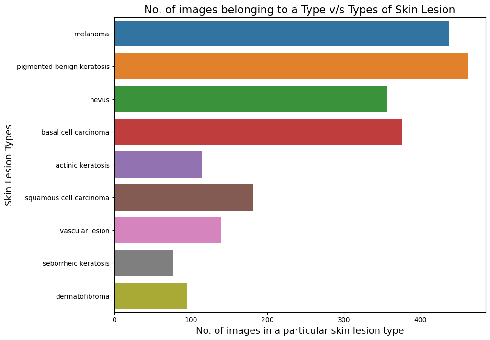
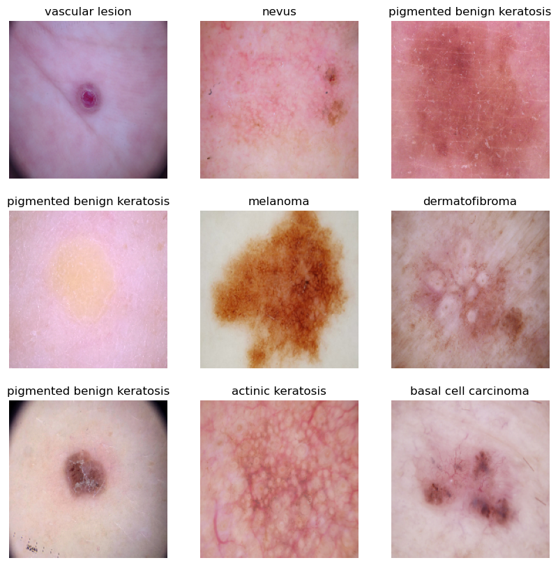
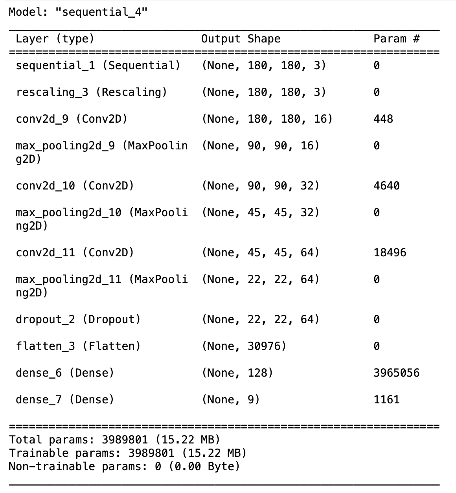
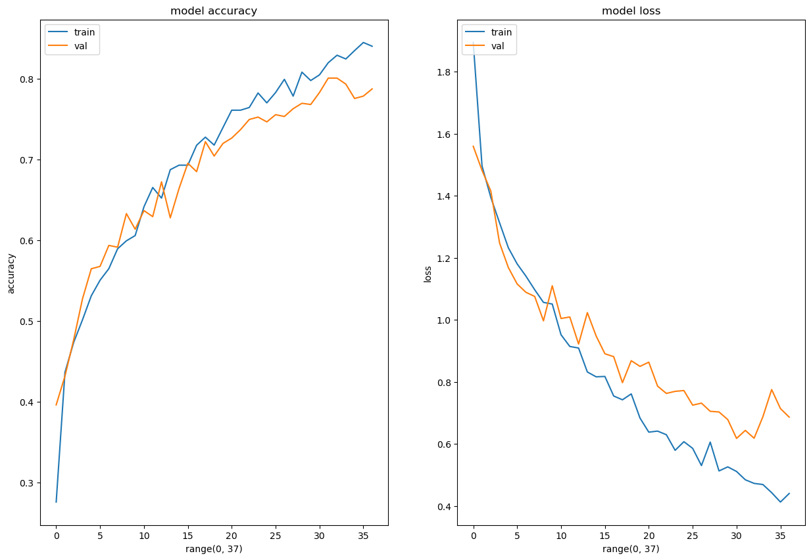

# Melanoma Skin Cancer Detection

## Abstract

In the realm of cancer, there exist over 200 distinct forms, with melanoma standing out as the most lethal type of skin cancer among them. The diagnostic protocol for melanoma typically initiates with clinical screening, followed by dermoscopic analysis and histopathological examination. Early detection of melanoma skin cancer is pivotal, as it significantly enhances the chances of successful treatment. The initial step in diagnosing melanoma skin cancer involves visually inspecting the affected area of the skin. Dermatologists capture dermatoscopic images of the skin lesions using high-speed cameras, which yield diagnostic accuracies ranging from 65% to 80% for melanoma without supplementary technical assistance. Through further visual assessment by oncologists and dermatoscopic image analysis, the overall predictive accuracy of melanoma diagnosis can be elevated to 75% to 84%. The objective of the project is to construct an automated classification system leveraging image processing techniques to classify skin cancer based on images of skin lesions.

## Problem statement

To build a CNN based model which can accurately detect melanoma. Melanoma is a type of cancer that can be deadly if not detected early. It accounts for 75% of skin cancer deaths. A solution which can evaluate images and alert the dermatologists about the presence of melanoma has the potential to reduce a lot of manual effort needed in diagnosis.

## Table of Contents

- [General Info](#general-information)
- [Model Architecture](#model-architecture)
- [Model Summary](#model-summary)
- [Model Evaluation](#model-evaluation)
- [Technologies Used](#technologies-used)
- [Acknowledgements](#acknowledgements)
- [Collaborators](#collaborators)

<!-- You can include any other section that is pertinent to your problem -->

## General Information

The dataset comprises 2357 images depicting malignant and benign oncological conditions, sourced from the International Skin Imaging Collaboration (ISIC). These images were categorized based on the classification provided by ISIC, with each subset containing an equal number of images.

In order to address the challenge of class imbalance, the Augmentor Python package (https://augmentor.readthedocs.io/en/master/) was employed to augment the dataset. This involved generating additional samples for all classes, ensuring that none of the classes had insufficient representation.

## Pictorial representation of skin types

The aim of this task is to assign a specific class label to a particular type of skin cancer.

## Model Architecture

The break down of the final provided CNN architecture step by step:

1. **Data Augmentation**: The `augmentation_data` variable refers to the augmentation techniques applied to the training data. Data augmentation is used to artificially increase the diversity of the training dataset by applying random transformations such as rotation, scaling, and flipping to the images. This helps in improving the generalization capability of the model.

2. **Normalization**: The `Rescaling(1./255)` layer is added to normalize the pixel values of the input images. Normalization typically involves scaling the pixel values to a range between 0 and 1, which helps in stabilizing the training process and speeding up convergence.

3. **Convolutional Layers**: Three convolutional layers are added sequentially using the `Conv2D` function. Each convolutional layer is followed by a rectified linear unit (ReLU) activation function, which introduces non-linearity into the model. The `padding='same'` argument ensures that the spatial dimensions of the feature maps remain the same after convolution. The number within each `Conv2D` layer (16, 32, 64) represents the number of filters or kernels used in each layer, determining the depth of the feature maps.

4. **Pooling Layers**: After each convolutional layer, a max-pooling layer (`MaxPooling2D`) is added to downsample the feature maps, reducing their spatial dimensions while retaining the most important information. Max-pooling helps in reducing computational complexity and controlling overfitting.

5. **Dropout Layer**: A dropout layer (`Dropout`) with a dropout rate of 0.2 is added after the last max-pooling layer. Dropout is a regularization technique used to prevent overfitting by randomly dropping a fraction of the neurons during training.

6. **Flatten Layer**: The `Flatten` layer is added to flatten the 2D feature maps into a 1D vector, preparing the data for input into the fully connected layers.

7. **Fully Connected Layers**: Two fully connected (dense) layers (`Dense`) are added with ReLU activation functions. The first dense layer consists of 128 neurons, and the second dense layer outputs the final classification probabilities for each class label.

8. **Output Layer**: The number of neurons in the output layer is determined by the `target_labels` variable, representing the number of classes in the classification task. The output layer does not have an activation function specified, as it is followed by the loss function during training.

9. **Model Compilation**: The model is compiled using the Adam optimizer (`optimizer='adam'`) and the Sparse Categorical Crossentropy loss function (`loss=tf.keras.losses.SparseCategoricalCrossentropy(from_logits=True)`), which is suitable for multi-class classification problems. Additionally, accuracy is chosen as the evaluation metric (`metrics=['accuracy']`).

10. **Training**: The model is trained using the `fit` method with the specified number of epochs (`epochs=50`). The `ModelCheckpoint` and `EarlyStopping` callbacks are employed to monitor the validation accuracy during training. The `ModelCheckpoint` callback saves the model with the best validation accuracy, while the `EarlyStopping` callback stops training if the validation accuracy does not improve for a specified number of epochs (patience=5 in this case). These callbacks help prevent overfitting and ensure that the model converges to the best possible solution.

## Model Summary

## Model Evaluation

## Technologies Used

- [Python](https://www.python.org/) - version 3.11.4
- [Matplotlib](https://matplotlib.org/) - version 3.7.1
- [Numpy](https://numpy.org/) - version 1.24.3
- [Pandas](https://pandas.pydata.org/) - version 1.5.3
- [Seaborn](https://seaborn.pydata.org/) - version 0.12.2
- [Tensorflow](https://www.tensorflow.org/) - version 2.15.0

<!-- As the libraries versions keep on changing, it is recommended to mention the version of library used in this project -->

## Acknowledgements

- UpGrad tutorials on Convolution Neural Networks (CNNs) on the learning platform

- [Melanoma Skin Cancer](https://www.cancer.org/cancer/melanoma-skin-cancer/about/what-is-melanoma.html)

- [Introduction to CNN](https://www.analyticsvidhya.com/blog/2021/05/convolutional-neural-networks-cnn/)

- [Image classification using CNN](https://www.analyticsvidhya.com/blog/2020/02/learn-image-classification-cnn-convolutional-neural-networks-3-datasets/)

- [Efficient way to build CNN architecture](https://towardsdatascience.com/a-guide-to-an-efficient-way-to-build-neural-network-architectures-part-ii-hyper-parameter-42efca01e5d7)

## Collaborators

Created by [@akashkriplani](https://github.com/akashkriplani)
